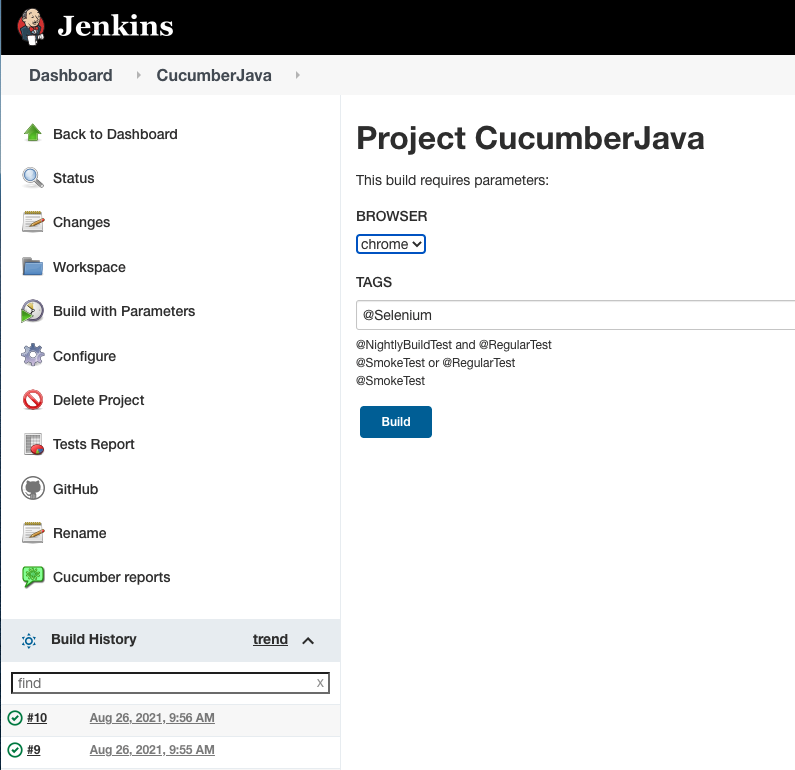
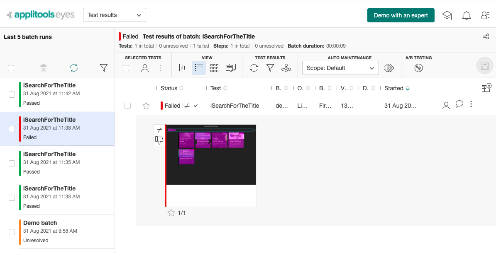
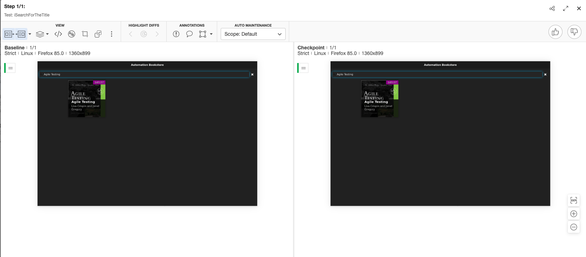
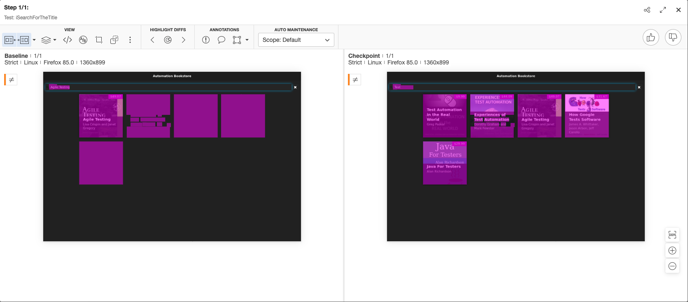

## Running Test Scenarios from Gradle
It's possible to run cucumber from `gradle` all thanks to the configuration we set in the `build.gradle` file:

```groovy
plugins {
    id "se.thinkcode.cucumber-runner" version "0.0.8"
}

configurations {
    cucumberRuntime {
        extendsFrom testImplementation
    }
}

cucumber {
    main = 'io.cucumber.core.cli.Main'
    featurePath = 'src/test/java/linkedinlearning/cucumber/features'
    glue = 'classpath:linkedinlearning/cucumber/stepdefinitions'
    plugin = ['pretty']
}
```

Run all test Scenarios:
```shell
$ ./gradlew cucumber
```

Run test Scenarios using tags:
```shell
$ ./gradlew cucumber --tags "@MenuManagementTest"
$ ./gradlew cucumber --tags "@RegularTest"
$ ./gradlew cucumber --tags "@SmokeTest"
```

Run test Scenarios using tags and logical operators (`and`, `or`, `not`):
```shell
$ ./gradlew cucumber --tags "@NightlyBuildTest and @RegularTest"
$ ./gradlew cucumber --tags "@SmokeTest or @RegularTest"
$ ./gradlew cucumber --tags "not (@NightlyBuildTest and @RegularTest)"
```

## Running Test Scenarios from test runner

By specifying a file like `MenuManagementTest.java` we can simply execute as it was a Junit file, it will execute the test scenarios that match with the specified conditions:

```java
import io.cucumber.junit.Cucumber;
import io.cucumber.junit.CucumberOptions;
import org.junit.runner.RunWith;

@RunWith(Cucumber.class)
@CucumberOptions(
        features = {"src/test/java/linkedinlearning/cucumber/features/MenuManagement.feature"},
        glue = {"linkedinlearning/cucumber/stepdefinitions"},
        tags = "not (@NightlyBuildTest and @RegularTest)",
        plugin = {"pretty"}
)
public class MenuManagementTest {
}
```

Notice this runner does not have an actual implementation, and that is expected.

## Running Selenium Test Scenarios

Start the selenium-grid

```shell
$ cd selenium_grid/
$ sudo docker-compose up -d
```

From **Gradle cli** you can set the env-var `BROWSER` which points to the desired browser
```shell
$ ./gradlew cucumber --tags "@Selenium" -D BROWSER=opera
```

Or from **Intellij** you can modify the `build.gradle` file by setting the browser property like this:

```groovy
test{
    systemProperty "BROWSER", "opera"
}
```
## Configuring the Jenkins job

Install jenkins (MacOS)
```shell
$ brew install jenkins-lts
$ brew services start jenkins-lts
```
Provide the master password
```shell
$ cat .jenkins/secrets/initialAdminPassword
```
### Required Plugins:
* [Ansicolor](https://plugins.jenkins.io/ansicolor/): To show colors in console output
  
* [Cucumber reports](https://plugins.jenkins.io/cucumber-reports/): Which reads the json report and presents it in a nice way.
  
* [Html publisher](https://plugins.jenkins.io/htmlpublisher/): Publishes the Html report Cucumber creates.
  
**Note:** If necessary, do not forget to enable folders browsing in the node the job is going to run
```
System.setProperty("hudson.model.DirectoryBrowserSupport.CSP", "")
```
### Job Definition:
* Build Parameters:
  * Choice Parameter **BROWSER**
  * String Parameter **TAGS**
* Build Steps
```shell
$ ./gradlew cucumber --tags "${TAGS}" -DBROWSER=${BROWSER}
```

### Jenkins Job
Job created:


Build with parameters:


## Visual Testing - Applitools Eyes

For this project we have used [Applitools Eyes](https://applitools.com/) which is a cloud based service that allows us to analyze images using AI.

All we have to do is create a free account and then set the api key as we do in the hooks (we use VM options to set the api key):

```java
import com.applitools.eyes.selenium.Eyes;

Eyes eyes = new Eyes();
eyes.setApiKey(System.getProperty("applitools.api.key"));
```
Having eyes ready for use, we can validate a specific webpage by using the following instructions:
```java
eyes.open(driver, appName, testName);
eyes.checkWindow();
eyes.close();
```
Where `open` method takes as arguments the `Webdriver driver` where the webpage is displayed and a custom appName and testName, so you can easily identify the results at the Applitools portal:



### Eyes - Succeeded test


### Eyes - Failed test

Also will throw an `com.applitools.eyes.exceptions.DiffsFoundException` exception indicating Eyes has found differences

## Gradle

Initialize the project
```shell
$ gradle wrapper
```

Show all tasks
```shell
$ ./gradlew tasks --all
```